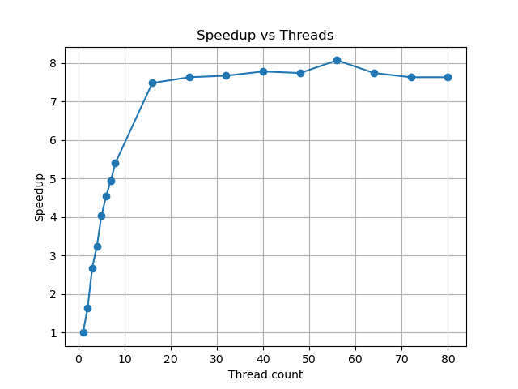

Run Threads Results: 

|Thread Count|Wall Clock Time|User Time|System Time|Speedup|
|:--:|--:|--:|--:|:--:|
|1|15.18|13.79| 0.57|1.00|
|2| 9.27|17.36| 0.64| 1.64|
|3| 5.67|15.12| 0.83| 2.68|
|4| 4.68|16.11| 0.89| 3.24|
|5| 3.76|15.55| 0.99| 4.04|
|6| 3.34|15.90| 1.13| 4.54|
|7| 3.07|16.35| 1.28| 4.94|
|8| 2.81|16.69| 1.32| 5.40|
|16| 2.03|18.03| 3.08| 7.48|
|24| 1.99|18.94| 5.93| 7.63|
|32| 1.98|18.54| 8.58| 7.67|
|40| 1.95|17.61|18.00| 7.78|
|48| 1.96|17.13|17.05| 7.74|
|56| 1.88|16.72|26.11| 8.07|
|64| 1.96|17.25|16.16| 7.74|
|72| 1.99|17.77|13.53| 7.63|
|80| 1.99|17.50|16.40| 7.63|

Graph for run trials:

 
